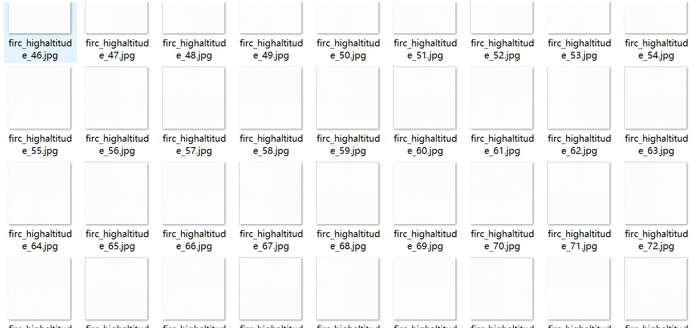
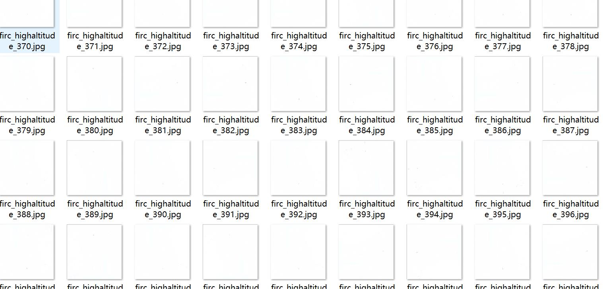
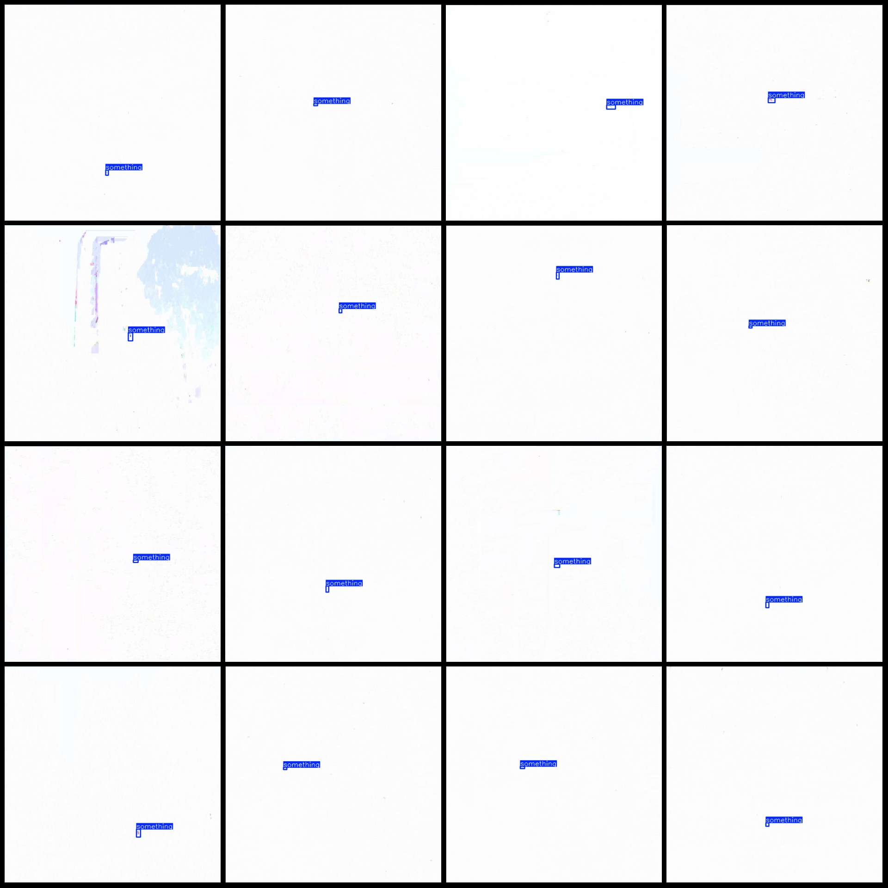
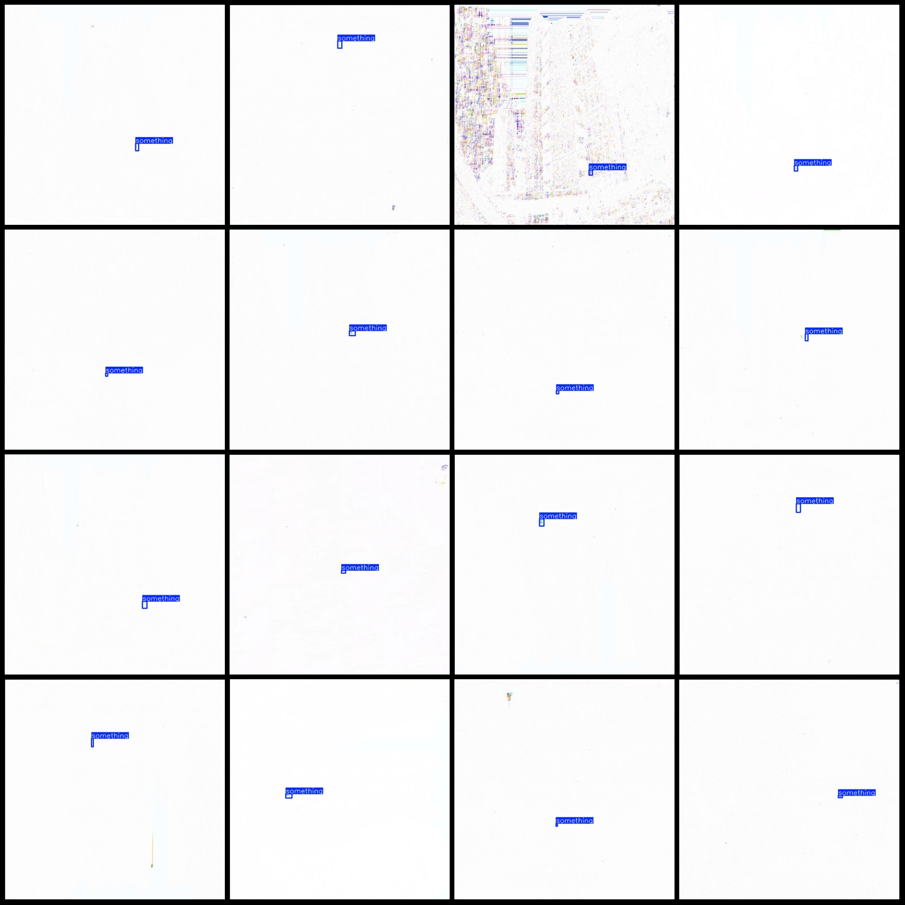

# High-altitude Object Detection and Detection Dataset (VOC+YOLO)

This dataset contains a collection of images with objects that have been dropped from high locations, which are referred to as "high-altitude objects." The images depict these objects, which are 
typically small and appear as a vague black area against a white background.

The dataset is organized in Pascal VOC format along with YOLO format (excluding the txt file containing the split path; it only includes the jpg image files along with their corresponding VOC and 
YOLO format txt files).

**Image Count:** 1941 JPG files
**Annotation Count:** 1941 XML files
**Annotation Count:** 1941 TXT files
**Number of Annotations:** 1
**Annotation Type:** ["something"]
**Number of Boxes for Each Class:**
- Something box count = 1941
**Total Boxes:** 1941
**Image Resolution:** 640x640
**Annotation Tool:** labelImg
**Annotation Rules:** Draw boxes around the categories

**Note:** This dataset does not include any splitting into training, validation, or test sets; users must manually divide them.

**Special Notice:** This dataset does not guarantee the accuracy of models trained on it or the weights of the files.

**Image Preview:**

**Example of Annotation:**

## Image

Here is a pay link on Stripe ( https://buy.stripe.com/3cs8yP7sY87d0vu9AB ). Please contact me lonlonago@foxmail.com after funding $89, and I will send you a complete data files , thank you!

